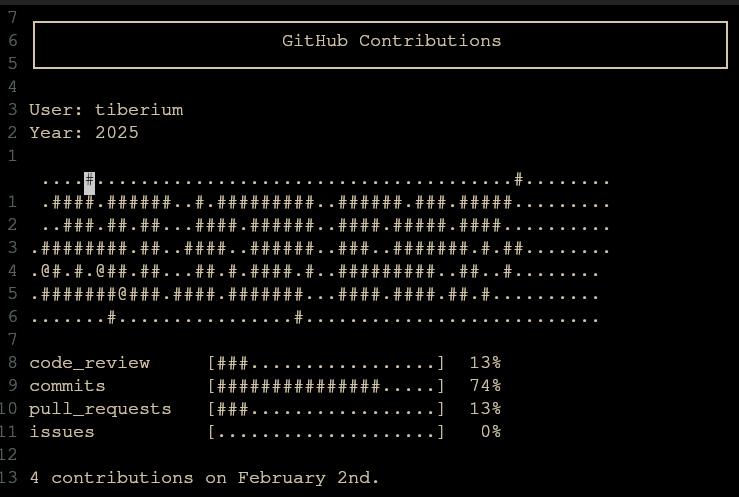

# nvim-gh-dashboard

A Neovim plugin that displays GitHub contribution graphs directly in your editor. View your own or any GitHub user's contributions & activities in a beautiful ASCII graph format.

> **⚠️ Note: This plugin is currently in alpha development stage.**  
> The plugin is under active development and may undergo significant changes. Features, configuration options, and API may change frequently. Use at your own discretion and expect potential breaking changes in future updates.



## Features

- 📊 **ASCII Contribution Graph** - Beautiful visualization of GitHub contributions 
- 👤 **ASCII Activity Graph** - Beautiful summary visualization of GitHub activities
- 🎯 **Interactive Cursor** - Move cursor to see contribution details for specific days
- ⚙️ **Configurable** - Set custom username and year
- 🚀 **Fast** - Fetches data directly from GitHub
- 🎨 **Colorful UI** - Read-only buffer, colored using your current colorscheme's palette, fully customizable

## Requirements

- Neovim >= 0.7.0
- [plenary.nvim](https://github.com/nvim-lua/plenary.nvim) - Required for HTTP requests

## Installation

### Using [lazy.nvim](https://github.com/folke/lazy.nvim)

```lua
{
  "tiberium/nvim-gh-dashboard", -- Replace with actual repo path
  dependencies = { "nvim-lua/plenary.nvim" },
  config = function()
    require("nvim-gh-dashboard").setup()
  end
}
```

### Using [packer.nvim](https://github.com/wbthomason/packer.nvim)

```lua
use {
  "tiberium/nvim-gh-dashboard", -- Replace with actual repo path
  requires = { "nvim-lua/plenary.nvim" },
  config = function()
    require("nvim-gh-dashboard").setup()
  end
}
```

### Development Installation

If you want to play around with the plugin, clone this repository, and configure the plugin (lazy):

```lua
{
  dir = "~/path/to/nvim-gh-dashboard", -- Your local path
  dependencies = { "nvim-lua/plenary.nvim" },
  config = function()
    require("nvim-gh-dashboard").setup()
  end
}
```

## Configuration

### Basic Usage

```lua
-- Uses defaults: current year, "torvalds" username
require("nvim-gh-dashboard").setup()
```

### Custom Configuration

```lua
require("nvim-gh-dashboard").setup({
  username = "octocat",  -- GitHub username to display
  year = 2023           -- Year to show contributions for
})
```

### Configuration Options

| Option | Type | Default | Description |
|--------|------|---------|-------------|
| `username` | `string` | `"torvalds"` | GitHub username whose contributions to display |
| `year` | `number` | Current year | Year to fetch contributions for |
| `chars` | `table` | See below | Characters used to render the graph |
| `chars.filled` | `string` | `"#"` | Character for days with contributions |
| `chars.high` | `string` | `"@"` | Character for days with the highest single-day contribution count, as flagged by GitHub |
| `chars.empty` | `string` | `"."` | Character for days with no contributions |
| `colors` | `table` | See below | Highlight group overrides, keyed by group name (see [Colors](#colors)) |

### Colors

Just like on github.com, the contribution graph is rendered with multiple
shades of "intensity" and the activity bars, their borders/brackets and the
header use distinct colors from one another, so everything is easy to tell
apart at a glance.

Colors are **not** hard-coded: every highlight group used by the plugin is
`link`-ed by default to a built-in Neovim highlight group (`String`, `Title`,
`DiagnosticWarn`, ...), so the dashboard automatically re-uses whatever
palette your current colorscheme already defines. No extra colorscheme or
palette plugin is required.

| Highlight group | Default link | Used for |
|---|---|---|
| `GHDashboardHeaderBorder` | `FloatBorder` | The `┌─┐`/`└─┘` box border around the header |
| `GHDashboardHeaderTitle` | `Title` | The "GitHub Contributions" header title |
| `GHDashboardHeaderLabel` | `Comment` | The `User:`/`Year:` labels |
| `GHDashboardHeaderValue` | `Identifier` | The configured username/year values |
| `GHDashboardEmpty` | `Comment` | Days with no contributions |
| `GHDashboardLevel1` | `DiagnosticHint` | Days with 1-3 contributions |
| `GHDashboardLevel2` | `DiagnosticInfo` | Days with 4-6 contributions |
| `GHDashboardLevel3` | `DiagnosticOk` | Days with 7-9 contributions |
| `GHDashboardLevel4` | `String` | Days with 10-99 contributions |
| `GHDashboardHigh` | `DiagnosticWarn` (bold) | Days with **100+ contributions**, as flagged by GitHub - intentionally distinct from the green scale above so your best days stand out |
| `GHDashboardActivityLabel` | `Identifier` | The activity type label (`commits`, `issues`, ...) |
| `GHDashboardActivityBorder` | `NonText` | The `[`/`]` brackets around each activity bar |
| `GHDashboardActivityBarFilled` | `Function` | The filled portion of an activity bar |
| `GHDashboardActivityBarEmpty` | `Comment` | The empty portion of an activity bar |
| `GHDashboardActivityPercent` | `Number` | The trailing percentage value |

Every group can be overridden through `opts.colors`, using the same shape
accepted by `vim.api.nvim_set_hl()` (e.g. `{ fg = "#rrggbb" }`, `{ link =
"SomeOtherGroup" }`, `{ bold = true }`, ...). Overrides are merged on top of
the defaults, so you only need to specify the fields you want to change:

```lua
require("nvim-gh-dashboard").setup({
  colors = {
    -- Use explicit colors instead of linking to the colorscheme
    GHDashboardHigh = { fg = "#ff9e64", bold = true },
    -- Link to a different highlight group
    GHDashboardActivityBarFilled = { link = "DiagnosticOk" },
  }
})
```

You can also change the colors afterwards (e.g. when switching colorscheme)
by calling `require("nvim-gh-dashboard.colors").setup({ ... })` directly and
re-opening the dashboard.

### Examples

```lua
-- View your own contributions for current year
require("nvim-gh-dashboard").setup({
  username = "your-github-username"
})

-- View specific user's contributions for 2022
require("nvim-gh-dashboard").setup({
  username = "linus",
  year = 2022
})

-- View contributions for current year (uses torvalds as default)
require("nvim-gh-dashboard").setup({
  year = 2024
})

-- Customize graph characters
require("nvim-gh-dashboard").setup({
  username = "octocat",
  chars = {
    filled = "+",  -- Days with contributions
    high = "#",    -- Highest single-day contribution count, as flagged by GitHub
    empty = "."    -- Days with no contributions
  }
})

-- Customize colors, overriding only the highlight groups you care about
require("nvim-gh-dashboard").setup({
  username = "octocat",
  colors = {
    GHDashboardHigh = { fg = "#ff9e64", bold = true }, -- 100+ contributions
    GHDashboardActivityBarFilled = { link = "DiagnosticOk" },
  }
})
```

## Usage

1. **Launch**: Plugin automatically opens when Neovim starts (if configured in your init)
2. **Navigate**: Use arrow keys or `hjkl` to move cursor around the contribution graph
3. **View Details**: When cursor is on the graph, the bottom line shows contribution details for that day
4. **Read-Only**: The buffer is read-only, so you can't accidentally edit the content

## How It Works

The plugin:
1. Fetches contribution data from GitHub's public pages
2. Parses the HTML to extract contribution information
3. Generates an ASCII representation of the contribution graph
4. Generates an ASCII reporesentation of the activity graph, incase it is available
4. Displays it in a special Neovim buffer with interactive cursor tracking

## Graph Legend

- `#` - Days with contributions
- `@` - Days with 100+ contributions  
- `.` - Days with no contributions

*Note: Characters can be customized via the `chars` configuration option. Colors are also applied per
intensity level; see [Colors](#colors) for the full list of highlight groups and how to customize them.*

## Troubleshooting

**Plugin doesn't load:**
- Make sure `plenary.nvim` is installed
- Check that the GitHub username exists and is public

**No contributions shown:**
- Verify the username is correct
- Check if the user has public contributions for the specified year
- Some users may have private contribution graphs

**Network issues:**
- The plugin requires internet connection to fetch GitHub data

## Testing

Tests are written with [plenary.nvim](https://github.com/nvim-lua/plenary.nvim)'s busted-style test harness. To run them:

```sh
PLENARY_PATH=/path/to/plenary.nvim \
  nvim --headless --noplugin -u tests/minimal_init.lua \
  -c "PlenaryBustedDirectory tests/ {minimal_init = 'tests/minimal_init.lua'}"
```

`PLENARY_PATH` can be omitted if `plenary.nvim` is already installed in one of the common plugin manager locations.

## Contributing

Contributions are welcome! Please feel free to submit issues, feature requests, or pull requests.

## License

MIT License - see [LICENSE](LICENSE) file for details.

## Acknowledgments

- Inspired by GitHub's contribution graph
- Built with [plenary.nvim](https://github.com/nvim-lua/plenary.nvim) for HTTP requests
- Thanks to the Neovim community for plugin development resources
