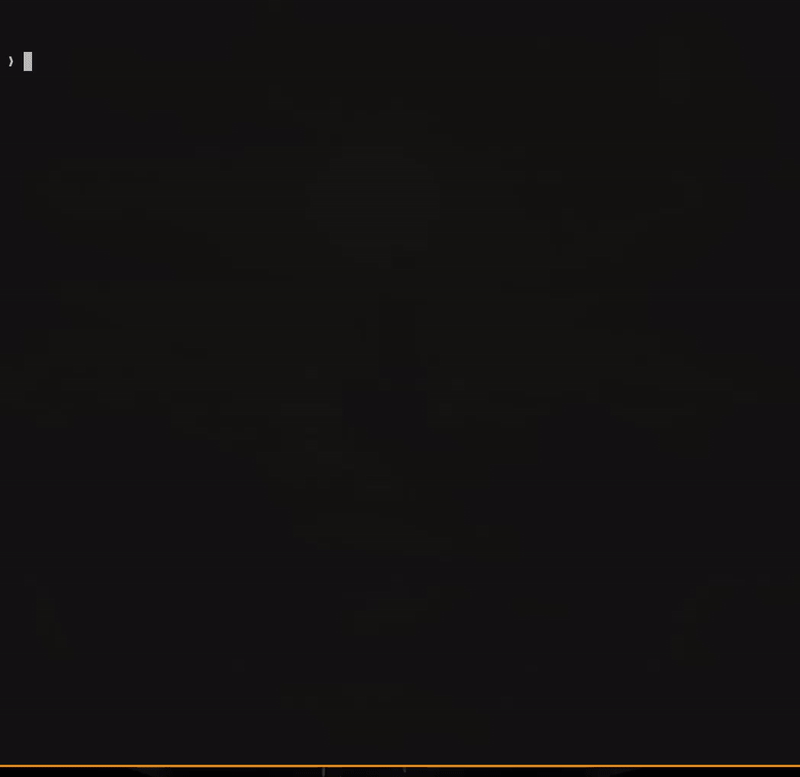
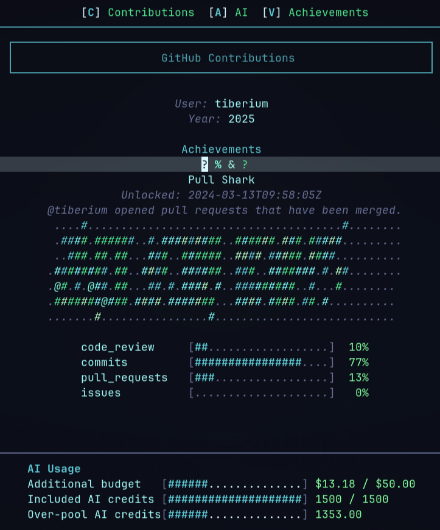
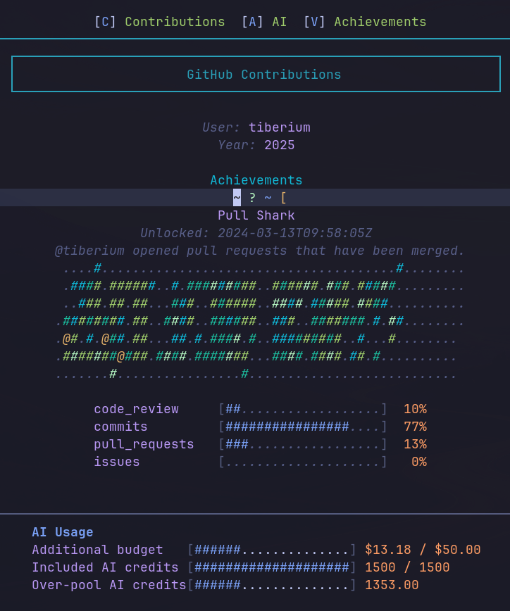
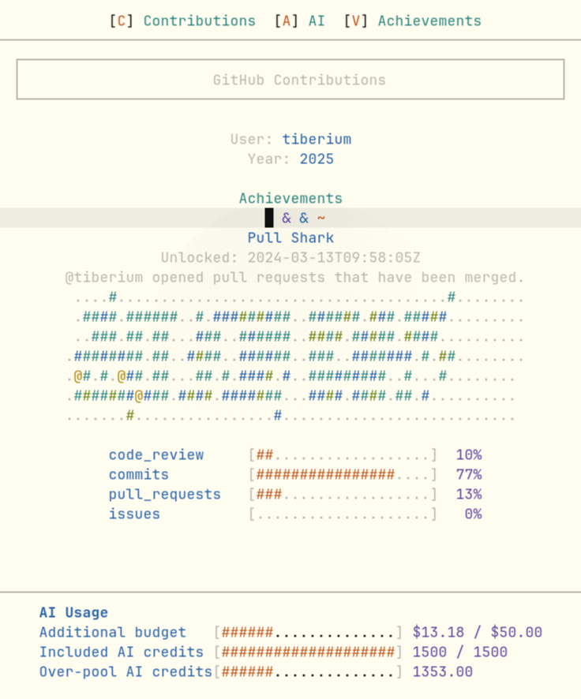

# nvim-gh-dashboard

A Neovim dashboard for public GitHub profile data, rendered as ASCII art.



## Features

- 📊 **Contribution calendar** with per-day details under the cursor
- 👤 **Activity breakdown** for code review, commits, pull requests, and issues
- 👥 **Profile statistics** for followers and following
- 🏆 **Achievements** with unlock date and description on selection
- 💳 **AI Usage**: included credits, over-pool credits, and additional budget
- 🎨 **Colorful UI** that inherits and can override your colorscheme
- 🚀 **Fast** async loading with spinners, so Neovim stays responsive

## Requirements

- Neovim >= 0.7.0
- [plenary.nvim](https://github.com/nvim-lua/plenary.nvim)
- [GitHub CLI](https://cli.github.com/) (optional, only for the AI Usage panel); authenticate with `gh auth login`

## Installation

### [lazy.nvim](https://github.com/folke/lazy.nvim)

```lua
{
  "tiberium/nvim-gh-dashboard",
  dependencies = { "nvim-lua/plenary.nvim" },
  opts = {},
}
```

### [packer.nvim](https://github.com/wbthomason/packer.nvim)

```lua
use {
  "tiberium/nvim-gh-dashboard",
  requires = { "nvim-lua/plenary.nvim" },
  config = function()
    require("nvim-gh-dashboard").setup()
  end,
}
```

## Setup and usage

```lua
require("nvim-gh-dashboard").setup({
  username = "octocat",
  year = 2023,
})
```

`setup()` opens the dashboard when Neovim starts without file arguments. Use
`:GHDashboard` at any time, including when Neovim was started with a file:

```vim
:GHDashboard
:GHDashboard octocat
:GHDashboard octocat 2023
```

The dashboard is read-only. Move through the contribution graph with normal
cursor motions to see the selected day's details. Its menu is focused when the
dashboard opens; use `C`, `A`, or `V`, or press `<Enter>` on a menu shortcut,
to focus Contributions, load AI Usage, or focus Achievements respectively.
Achievements load automatically; moving over a badge loads its details. AI
Usage is requested only after you select it.

## Configuration

| Option | Type | Default | Description |
|---|---|---|---|
| `username` | `string` | `"torvalds"` | GitHub username to display |
| `year` | `number` | Current year | Contributions year |
| `chars.filled` | `string` | `"#"` | Graph character for a non-empty value |
| `chars.high` | `string` | `"@"` | Graph character for GitHub's highest contribution day |
| `chars.empty` | `string` | `"."` | Graph character for an empty value |
| `achievement_chars` | `string` | `"%,&,*,(,[,?,!,+,=,~"` | One to ten comma-separated printable ASCII badge symbols |
| `colors` | `table` | `{}` | Highlight-group overrides |

`chars` defaults to `{ filled = "#", high = "@", empty = "." }`. The same
characters render contribution, activity, and AI Usage bars.

### Colors

By default, the dashboard follows the active colorscheme. Override only the
groups you need:

```lua
require("nvim-gh-dashboard").setup({
  colors = {
    GHDashboardHigh = { fg = "#ff9e64", bold = true },
    GHDashboardBarGraphFill = { link = "DiagnosticOk" },
  },
})
```

See [Color customization](COLORS.md) for every configurable highlight
group, its default link, and usage.





## Troubleshooting

- For basic functionality: contributions and activity diagrams, ensure the username exists and its profile/contributions are available for you to view.
- To enable all the features install and authenticate the GitHub CLI with `gh auth login`.

## Testing

Formatting and linting:

```sh
stylua --check lua tests plugin
luacheck lua tests plugin
```

Run the complete test suite:

```sh
PLENARY_PATH=/path/to/plenary.nvim \
  nvim --headless --noplugin -u tests/minimal_init.lua \
  -c "PlenaryBustedDirectory tests/nvim-gh-dashboard { minimal_init = 'tests/minimal_init.lua' }"
```

## Contributing

Contributions, issues, and feature requests are welcome.

## License

[MIT](LICENSE)
