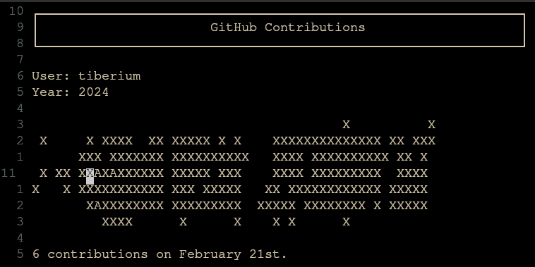

# nvim-gh-dashboard

A Neovim plugin that displays GitHub contribution graphs directly in your editor. View your own or any GitHub user's contribution activity in a beautiful ASCII graph format.

> **⚠️ Note: This plugin is currently in alpha development stage.**  
> The plugin is under active development and may undergo significant changes. Features, configuration options, and API may change frequently. Use at your own discretion and expect potential breaking changes in future updates.



## Features

- 📊 **ASCII Contribution Graph** - Beautiful visualization of GitHub activity
- 🎯 **Interactive Cursor** - Move cursor to see contribution details for specific days
- ⚙️ **Configurable** - Set custom username and year
- 🚀 **Fast** - Fetches data directly from GitHub
- 🎨 **Clean UI** - Read-only buffer with clear header information

## Requirements

- Neovim >= 0.7.0
- [plenary.nvim](https://github.com/nvim-lua/plenary.nvim) - Required for HTTP requests

## Installation

### Using [lazy.nvim](https://github.com/folke/lazy.nvim)

```lua
{
  "tiberium/nvim-gh-dashboard", -- Replace with actual repo path
  dependencies = { "nvim-lua/plenary.nvim" },
  config = function()
    require("nvim-gh-dashboard").setup()
  end
}
```

### Using [packer.nvim](https://github.com/wbthomason/packer.nvim)

```lua
use {
  "tiberium/nvim-gh-dashboard", -- Replace with actual repo path
  requires = { "nvim-lua/plenary.nvim" },
  config = function()
    require("nvim-gh-dashboard").setup()
  end
}
```

### Development Installation

If you want to play around with the plugin, clone this repository, and configure the plugin (lazy):

```lua
{
  dir = "~/path/to/nvim-gh-dashboard", -- Your local path
  dependencies = { "nvim-lua/plenary.nvim" },
  config = function()
    require("nvim-gh-dashboard").setup()
  end
}
```

## Configuration

### Basic Usage

```lua
-- Uses defaults: current year, "torvalds" username
require("nvim-gh-dashboard").setup()
```

### Custom Configuration

```lua
require("nvim-gh-dashboard").setup({
  username = "octocat",  -- GitHub username to display
  year = 2023           -- Year to show contributions for
})
```

### Configuration Options

| Option | Type | Default | Description |
|--------|------|---------|-------------|
| `username` | `string` | `"torvalds"` | GitHub username whose contributions to display |
| `year` | `number` | Current year | Year to fetch contributions for |

### Examples

```lua
-- View your own contributions for current year
require("nvim-gh-dashboard").setup({
  username = "your-github-username"
})

-- View specific user's contributions for 2022
require("nvim-gh-dashboard").setup({
  username = "linus",
  year = 2022
})

-- View contributions for current year (uses torvalds as default)
require("nvim-gh-dashboard").setup({
  year = 2024
})
```

## Usage

1. **Launch**: Plugin automatically opens when Neovim starts (if configured in your init)
2. **Navigate**: Use arrow keys or `hjkl` to move cursor around the contribution graph
3. **View Details**: When cursor is on the graph, the bottom line shows contribution details for that day
4. **Read-Only**: The buffer is read-only, so you can't accidentally edit the content

## How It Works

The plugin:
1. Fetches contribution data from GitHub's public pages
2. Parses the HTML to extract contribution information
3. Generates an ASCII representation of the contribution graph
4. Displays it in a special Neovim buffer with interactive cursor tracking

## Graph Legend

- `X` - Days with contributions
- `A` - Days with 100+ contributions  
- ` ` (space) - Days with no contributions

## Troubleshooting

**Plugin doesn't load:**
- Make sure `plenary.nvim` is installed
- Check that the GitHub username exists and is public

**No contributions shown:**
- Verify the username is correct
- Check if the user has public contributions for the specified year
- Some users may have private contribution graphs

**Network issues:**
- The plugin requires internet connection to fetch GitHub data

## Contributing

Contributions are welcome! Please feel free to submit issues, feature requests, or pull requests.

## License

MIT License - see [LICENSE](LICENSE) file for details.

## Acknowledgments

- Inspired by GitHub's contribution graph
- Built with [plenary.nvim](https://github.com/nvim-lua/plenary.nvim) for HTTP requests
- Thanks to the Neovim community for plugin development resources